# **ChatR'Box**

Marco Alexi Sta Ana - msta001@ucr.edu

## Live Website Link
[https://chatr--box.herokuapp.com/](https://chatr--box.herokuapp.com/)

## Proposal

### Plan

I planned to write a web chatroom website that allows users that go on the site and chat anonymously!

### Why?

Since the ongoing pandemic (2020) has people locked inside their houses and with social distancing being a must. I decided to create a little website to get people chatting and having at least a little interaction with each other in these unsocial times.

### Language and Technology

* HTML/CSS
* Javascript
* JQuery
* Node
* Heroku
* Socket.io

### Input/Output

* **Input**
  * Usernames entered by the user
  * Messages sent from the user
  * Colors of message bubble and text selected by the user

* **Output**
  * List of current users in the chatroom
  * Messages received from users
  * Messages displayed in user-defined message bubble and text colors

### System Description and UML Diagrams

The system is constructed by two parts, server side and client side. The sever side operates on our server, and the client side operates on the clients' computer. These two parts operate independently and shares information through the internet.

#### Server Side

The server receiving client's inputs and send the output back to the client side.

|   Class Name  | Description |
|     :---:     |     ---     |
|  ChatFactory  | - Grab chat message from the clients   - Send the Chat to the Chatroom (server) |
| ListOfUsers | - Get newly added/removed users from the clients    - Send the newly added/removed usernames to Chatroom |
| Chatroom (Server) | - Get mew Chat from ChatFactory   - Get updated users from NumberOfUsers   - Send new Chat and updated usernames to Client |

#### Client Side

The client side gets input from the user, send the chat message to the server and recieves updated chat information from the server and display it to the user.

| Class Name | Description  |
|:---:|---|
| Chatroom (Client) | - Display messages and a list of users   - Get chat message and list of current users from server side    - Display the messages to the user |
| ChatContainer | - Contains Chat classes   - Send Chat message to the server side |
| Chat | - Abstract class the holds texts and username   - Has two children: Text, ChatBubble|
| Text | - Inherent class from Chat   - Add basic text messages |
| ChatBubble | - Inherent class from Chat   - Displays chat message in a chat bubble |
| ChatDecorator | - Abstract class that add features to Chat   - Has three children: TextColor, ChatBubbleColor, GetEmoji|
| TextColor | - Inherent class from ChatDecorator   - Modifies Chat message text color |
| ChatBubbleColor | - Inherent class from ChatDecorator   - Modifies Chat bubble color |
| GetEmoji | - Inherent class from ChatDecorator   - Convert Emoji from Unicode to picture |

## Deliverable Report

### R'Chat in Action

#### Login

The user will first be greeted with a screen to enter a username. Then this username is sent to the server. If the username has not been used, the server updates list of users. The user will enter the chat room client website. A welcome message and a updated user list will be displayed display.

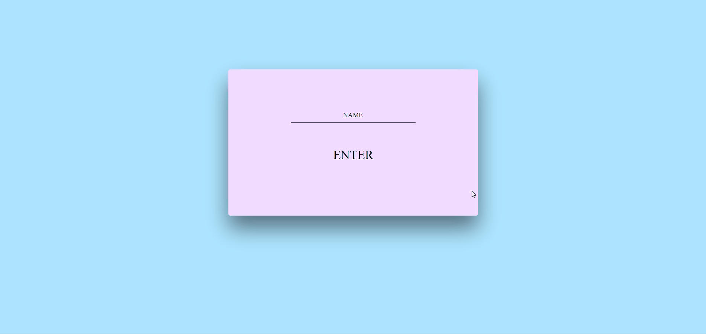

If the username is currently being used by someone else, the user will be prompt to enter another one.

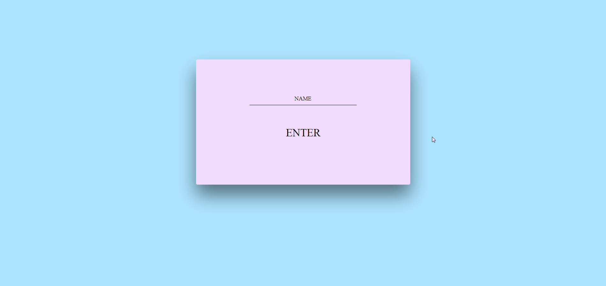

#### When someone joins/leaves

When some joins the chatroom, it will display the new user's username with a welcome message in the chat and add the username into the user list on the left side of the page.

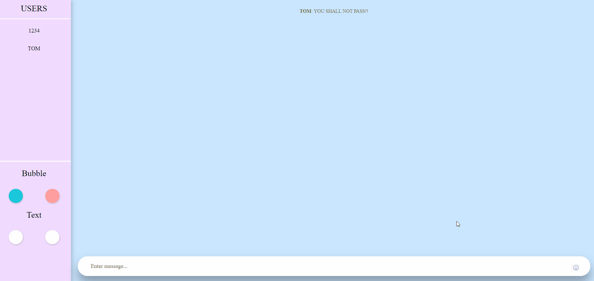

When some leaves the chatroom, it will display that user's username with a goodbye message on all other user's page and remove the username from the user list.

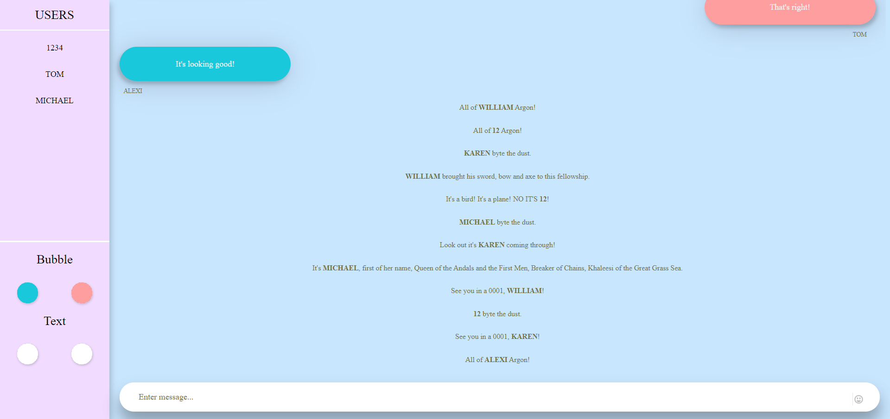

#### Sending a message

The user can enter his/her message in the textbox at the bottom of the page. The message is sent by either hitting the `enter` key or pressing the `send` button. The send button only appears when something is entered in the textbox. The sent message will appear on the right side of the chat area.

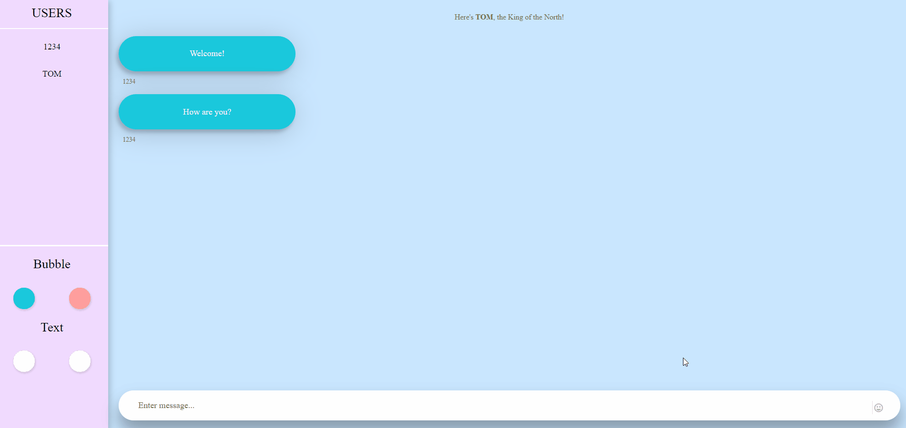

And an empty message won't be sent.

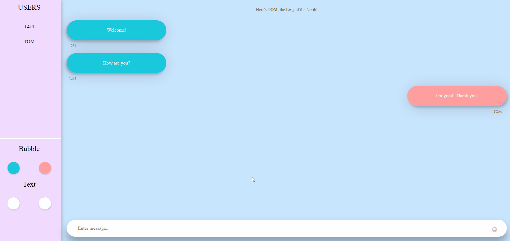

#### Sending an Emoji

There is an Emoji selector button on the right side of the textbox. User can select an Emoji to add to his/her chat message, and send it just like a regular message.

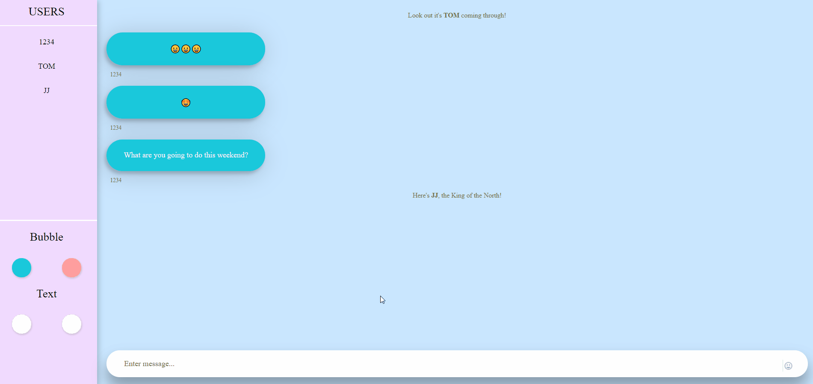

#### Receiving a message

When someone else sends a message, it will show up in a chat bubble on all users' page with the sender's username under the text bubble. These received messages will appear on the left side of the chat area.

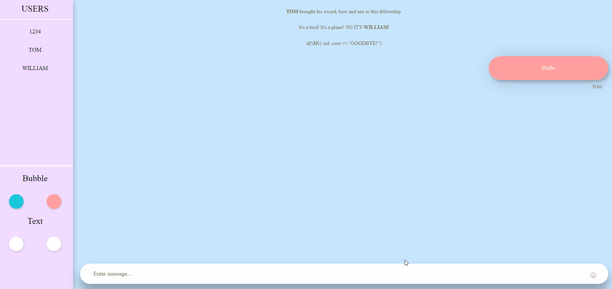

#### Customize the chat

A user can customize the appearance of the messages in the chat room by clicking the color selectors located at the bottom-left of the page and choosing a color he/her likes for the texts and chat bubbles sent or received.

Customizing sent messages:
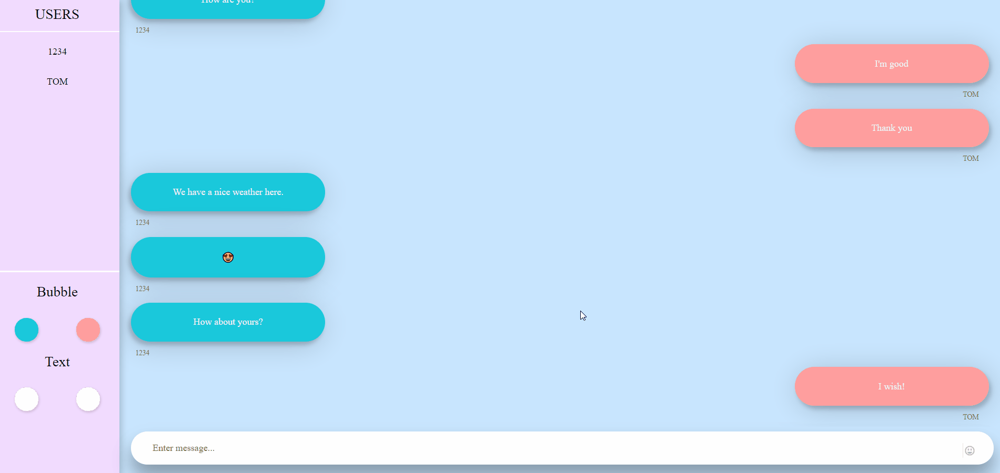

Customizing received messages:
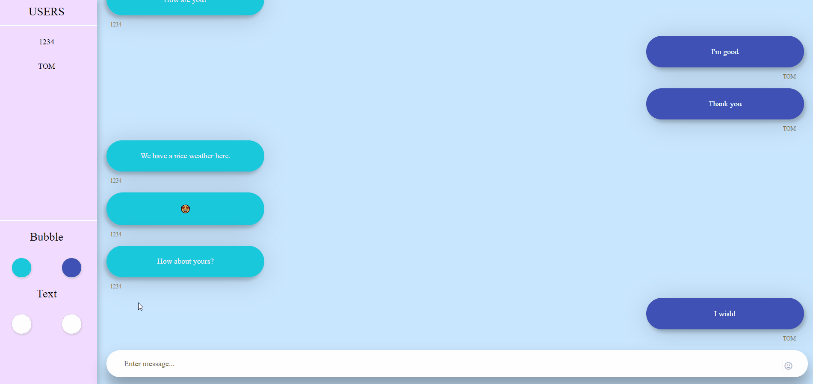

#### Chat history

A user can only see new messages after he/she entered the chat room. Once a user left, he/her can no longer see the messages before. However, his/her messages will still be available  for the other users who saw the messages and are still in the chat room.

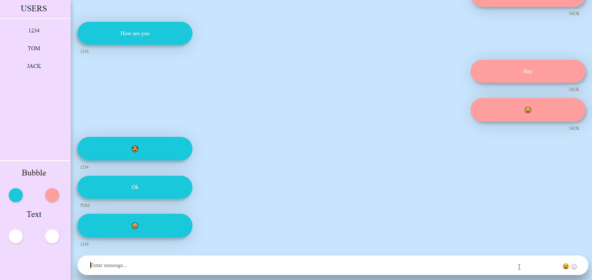

### Deploying R'Chat

The live demo for this project is deployed on [Heroku](www.heroku.com). The process is simple:

1. Create a Heroku account and login
2. Connect your GitHub account to Heroku
3. Create a new project and select "GitHub" as the deployment method
4. Select this repository to connect to
5. Select if you want to enable automatic deploys
6. Select the branch to be deployed
7. Click `Deploy Branch` and wait
8. Click `View` to visit the site

You can also follow [this link](https://devcenter.heroku.com/articles/getting-started-with-nodejs?singlepage=true) for instructions directly from Heroku.

##### Special Thanks to Jiacheng Hou (jhou028@ucr.edu) for helping with the readme! 
